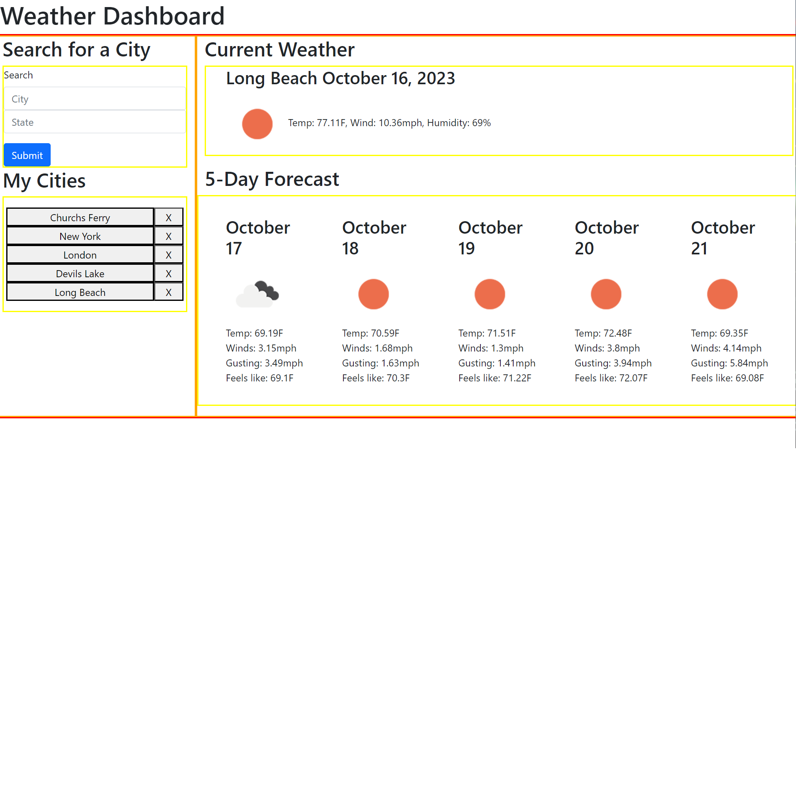

# 06 Server-Side APIs: Weather Dashboard

## Weather Dashboard

* Create a weather dashboard with api calls from openweather.com

## City Search

* There is an input fields for:
* * City
* * State
* When city and state are submitted that city is saved into local storage and added to My Cities
* * Each city has a delete button

## Current Weather

* When i click on a saved city or a enter a new city:
* * Date is displayed
* * Icon of current weather is displayed
* * Temp is displayed
* * Wind speed is displayed
* * Humidity is displayed

## Forecast Weather

* A day card for each of the following 5 days forecasted weather is displayed containing:
* * Date 
* * Icon of current weather 
* * Temp
* * Wind speed 
* * Wind Gusts
* * Real Feel

## Screenshot

## Deployed Page

* https://napoleondd86.github.io/weather-dashboard/

